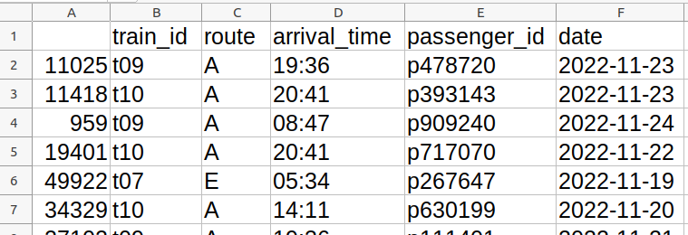

# A data science challenge

A data set and a conundrum, designed to teach fundamental data science concepts of data wrangling.
CC-BY Zahra Arjmandi & [Tom Stafford](https://tomstafford.sites.sheffield.ac.uk/), 2023

## The challenge

Passengers on City Trains complain that most journeys they take are too crowded. City Trains say that most journeys are less than half full. Who is right, and why?

## The data

Looks like this

Each row reflects data on a particular journey. The variables in the columns are

>**train_id** - an ID code for the train taking the journey
>	
>**route** - the route
>
>**arrival_time** - the arrival time
>
>**passenger_id** - an ID code for the passenger taking the journey
>	
>**date** - the date of the journey

## What you'll learn

The interesting questions in data analysis help you better understand the question, as much as they provide interesting answers. Although we've created an example with artificial data, we think tackling this problem will teach you a number of fundamental data science skills. These include

* dealing with under-specified questions
* data imports and preprocessing ("data wrangling")
* generating summary statistics using different basis-units

If this last item doesn't make much sense to you, you may be exactly the sort of person who would benefit from working through this challenge.
